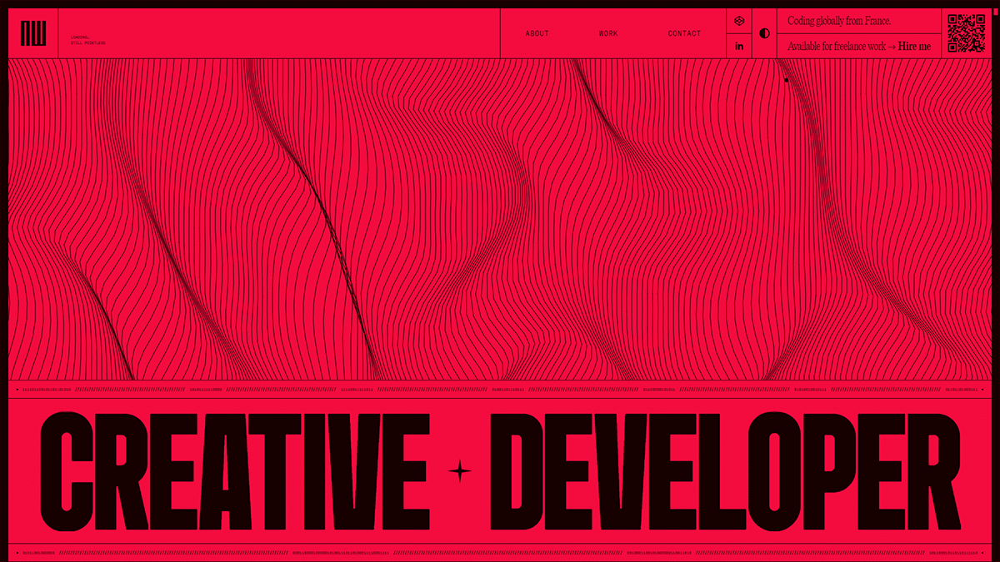

## Summary
Creative Developer with 15+ years and 140+ projects, specializing in animation-driven, high-impact websites. Partnering with designers to craft memorable UX.

## Key Details
- **Source:** [wodniack.dev](https://wodniack.dev/)
- **Title:** AW - Creative Developer Freelance - France
- **Description:** Creative Developer with 15+ years and 140+ projects, specializing in animation-driven, high-impact websites. Partnering with designers to craft memora

## Visual Assets

