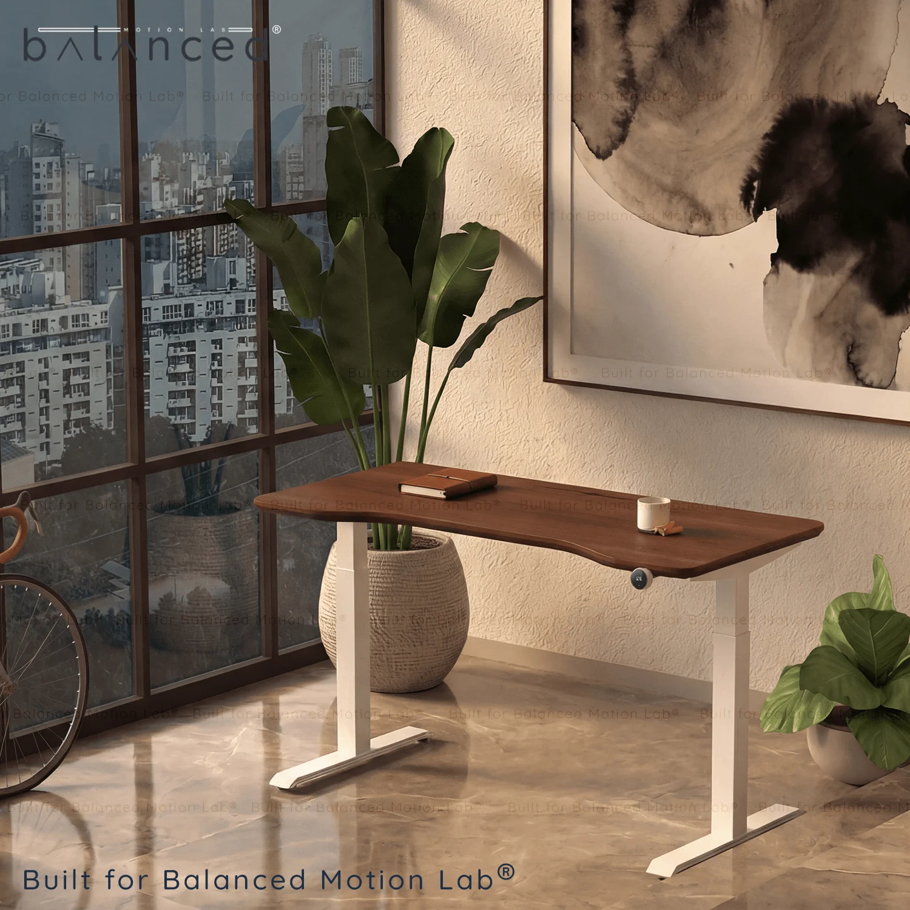

## Summary
Balanced Desk Pro 250 is a premium height adjustable desk frame with two motors and two-stage columns.

## Key Details
- **Source:** [ergosphere.in](https://ergosphere.in/shop/height-adjustable-tables/balanced-desk-pro-250-solid-teakwood-tabletop/)
- **Title:** Balanced Desk Pro 250 - Solid Teakwood Tabletop • Standing Desk
- **Description:** Balanced Desk Pro 250 is a premium height adjustable desk frame with two motors and two-stage columns.

## Visual Assets

