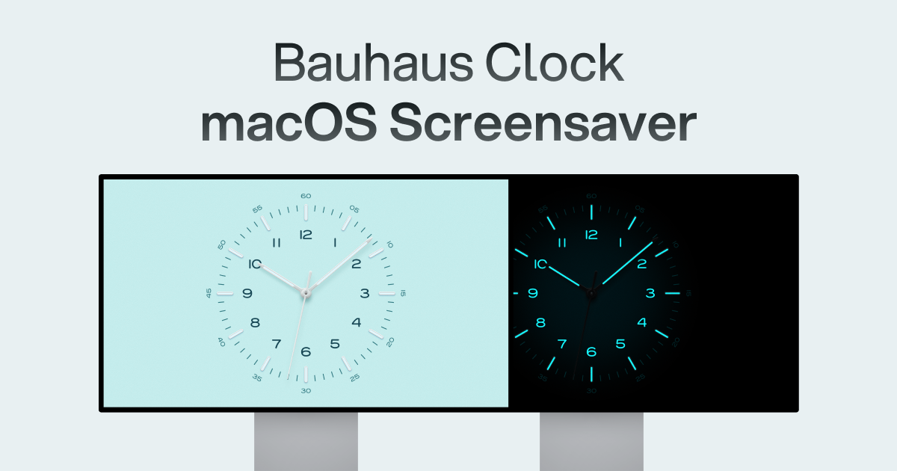

## Summary
Premium clock screensaver for Mac with authentic mechanical movements, customizable dials, and Bauhaus design. Transform your Mac

## Key Details
- **Source:** [bauhausclock.com](https://bauhausclock.com/)
- **Title:** Bauhaus Clock - Most Elegant Clock Screensaver for Mac
- **Description:** Premium clock screensaver for Mac with authentic mechanical movements, customizable dials, and Bauhaus design. Transform your Mac

## Visual Assets

