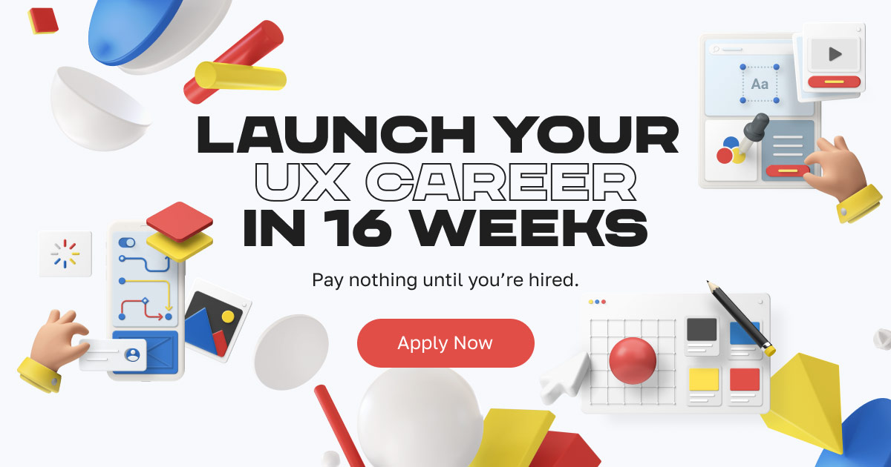

## Summary
Be a UX professional in 16 weeks. Get mentorship, work on real-world projects, build your portfolio, and land a full-time job. Pay nothing until you’re hired.

## Key Details
- **Source:** [university.uxpl.us](https://university.uxpl.us/#learn-more)
- **Title:** Be a UX professional in 16 weeks. Get mentorship, work on real-world projects, build your portfolio, and land a full-time job. Pay nothing until you’re hired.
- **Description:** Be a UX professional in 16 weeks. Get mentorship, work on real-world projects, build your portfolio, and land a full-time job. Pay nothing until you’r

## Visual Assets

