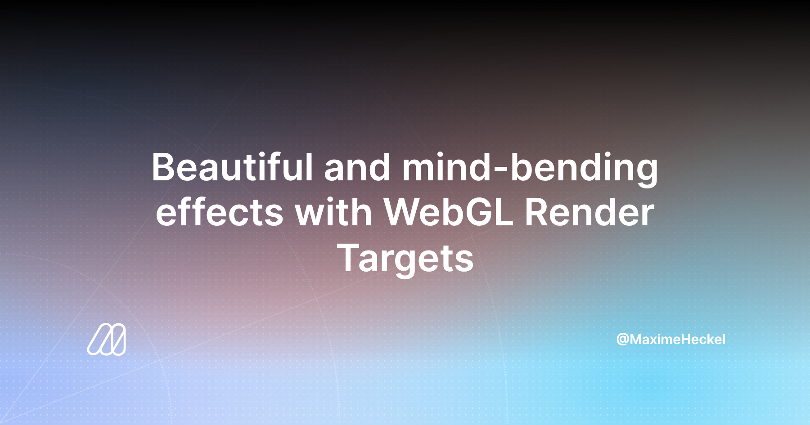

## Summary
A deep dive into WebGL Render Targets and how to leverage their capabilities in combination with the render loop to create scenes with post-processing effects, transition, and many types of optical il

## Key Details
- **Source:** [blog.maximeheckel.com](https://blog.maximeheckel.com/posts/beautiful-and-mind-bending-effects-with-webgl-render-targets/)
- **Title:** Beautiful and mind-bending effects with WebGL Render Targets - The Blog of Maxime Heckel
- **Description:** A deep dive into WebGL Render Targets and how to leverage their capabilities in combination with the render loop to create scenes with post-processing

## Visual Assets

