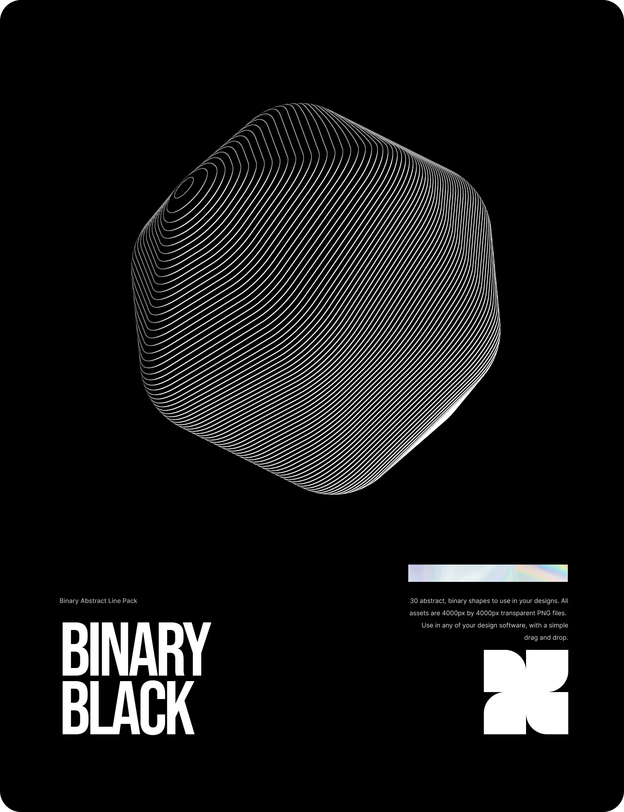

## Summary
30 transparent binary-inspired abstract design assets to give your next design a dystopian tech feel. Made with Spline design, these abstract line shapes come in 2 black and white colourways to help y

## Key Details
- **Source:** [vexus.digital](https://vexus.digital/products/binary)
- **Title:** Binary
- **Description:** 30 transparent binary-inspired abstract design assets to give your next design a dystopian tech feel. Made with Spline design, these abstract line sha

## Visual Assets

