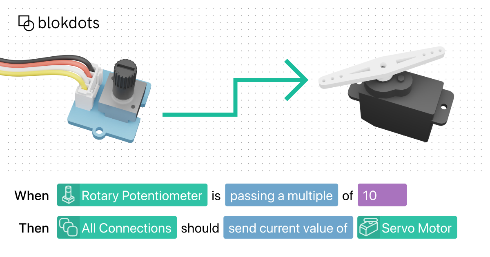

## Summary
blokdots is a simple to use software to build interactive hardware prototypes without a line of code.

## Key Details
- **Source:** [blokdots.com](https://blokdots.com/)
- **Title:** blokdots
- **Description:** blokdots is a simple to use software to build interactive hardware prototypes without a line of code.

## Visual Assets

