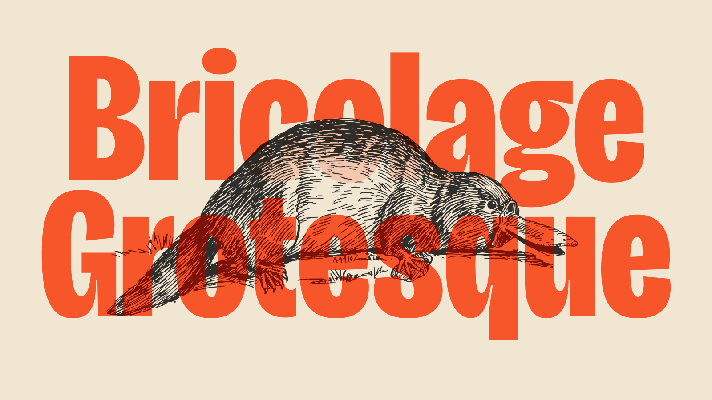

## Summary
An expressive variable font that blends iconic French and British designs across three axes: weight, width, and optical size. It visually expresses what it feels like when you cannot be what you were 

## Key Details
- **Source:** [ateliertriay.github.io](https://ateliertriay.github.io/bricolage?ref=sidebar)
- **Title:** Bricolage Grotesque — Free & Open Source Variable Font
- **Description:** An expressive variable font that blends iconic French and British designs across three axes: weight, width, and optical size. It visually expresses wh

## Visual Assets

