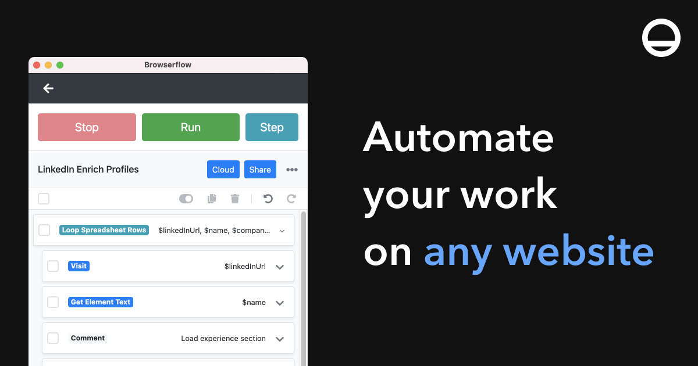

## Summary
Automate your work on any website

## Key Details
- **Source:** [browserflow.app](https://browserflow.app/)
- **Title:** Browserflow - Web Scraping & Web Automation
- **Description:** Automate your work on any website

## Visual Assets

