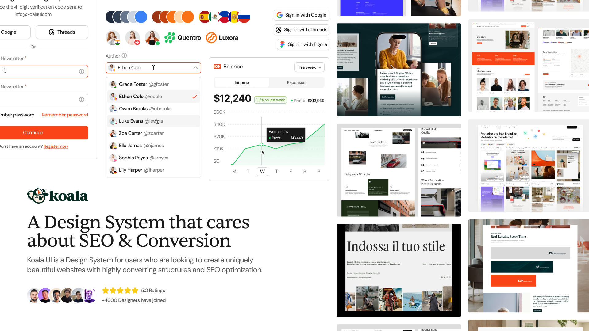

## Summary
Build AI-powered interfaces fast. 3,200+ components, chat UI, agent patterns, dashboards, and fully scalable design tokens. Designed for modern AI teams.

## Key Details
- **Source:** [koalaui.com](https://www.koalaui.com/)
- **Title:** Build AI-powered interfaces fast. 3,200+ components, chat UI, agent patterns, dashboards, and fully scalable design tokens. Designed for modern AI teams.
- **Description:** Build AI-powered interfaces fast. 3,200+ components, chat UI, agent patterns, dashboards, and fully scalable design tokens. Designed for modern AI tea

## Visual Assets

