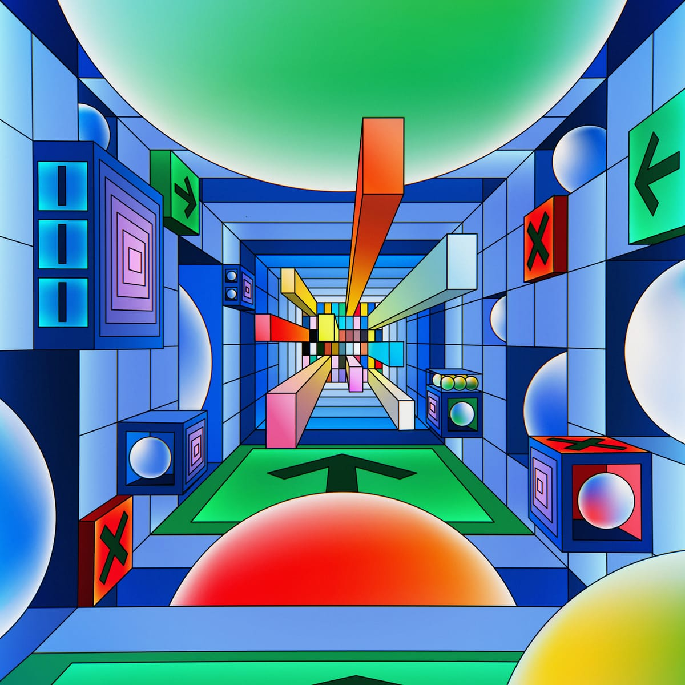

## Summary
Unless you have been living under a rock, you have heard of this new ChatGPT assistant made by OpenAI. Did you know, that you can run a whole virtual machine inside of ChatGPT?

## Key Details
- **Source:** [engraved.blog](https://www.engraved.blog/building-a-virtual-machine-inside/)
- **Title:** Building A Virtual Machine inside ChatGPT
- **Description:** Unless you have been living under a rock, you have heard of this new ChatGPT assistant made by OpenAI. Did you know, that you can run a whole virtual 

## Visual Assets

