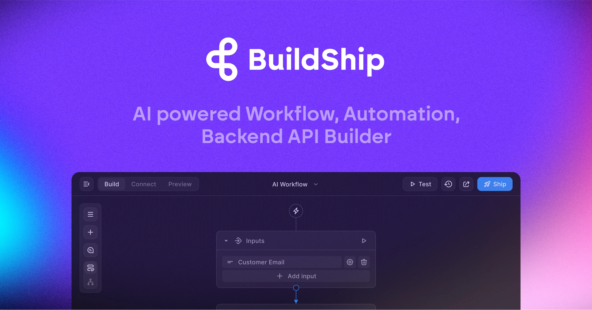

## Summary
BuildShip powers businesses to visually create AI workflows using natural language. Automate complex backend, develop tools for your AI agents, and easily spin up APIs. No code ease with full code acc

## Key Details
- **Source:** [buildship.com](https://buildship.com/)
- **Title:** BuildShip | AI Workflow Builder
- **Description:** BuildShip powers businesses to visually create AI workflows using natural language. Automate complex backend, develop tools for your AI agents, and ea

## Visual Assets

