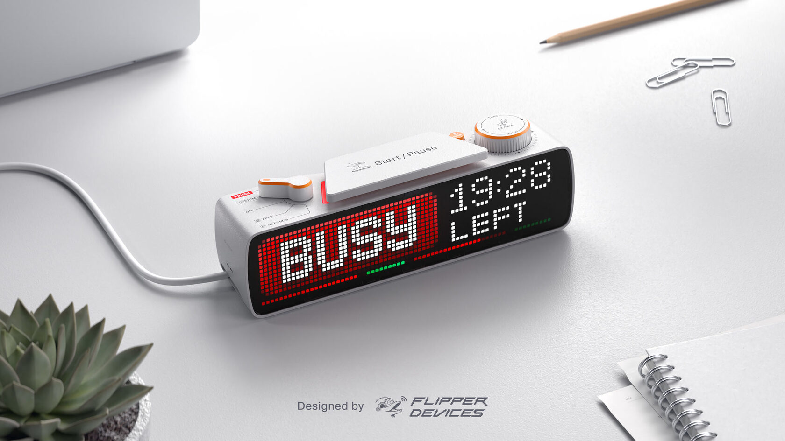

## Summary
Displays a personal busy message. Built-in Pomodoro timer and Apps. Fully customizable, open-source, and hacker-friendly

## Key Details
- **Source:** [busy.bar](https://busy.bar/?ref=onepagelove)
- **Title:** BUSY Bar — Productivity Multi-tool Device with an LED pixel screen
- **Description:** Displays a personal busy message. Built-in Pomodoro timer and Apps. Fully customizable, open-source, and hacker-friendly

## Visual Assets

