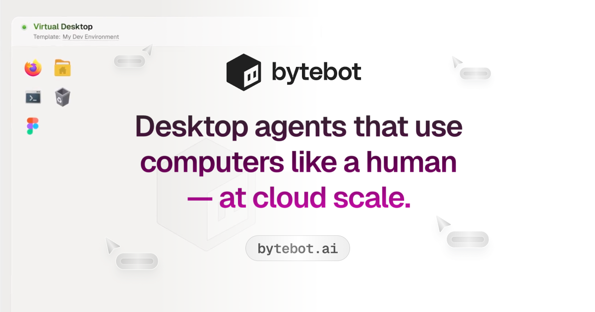

## Summary
Describe a task and Bytebot boots a fresh, sandboxed computer and completes work across multiple apps by the screen, then clicking and typing through the UI. Scale from one to hundreds of agents in pa

## Key Details
- **Source:** [bytebot.ai](https://www.bytebot.ai/?ref=producthunt)
- **Title:** Bytebot - Desktop agents that use computers like a human — at cloud scale.
- **Description:** Describe a task and Bytebot boots a fresh, sandboxed computer and completes work across multiple apps by the screen, then clicking and typing through 

## Visual Assets

