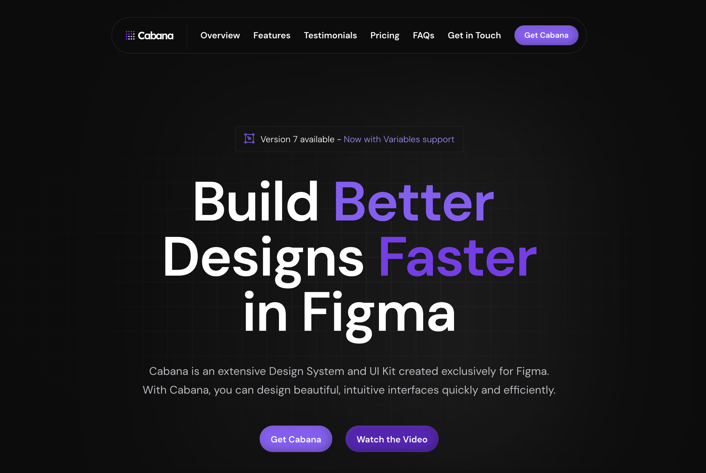

## Summary
With Cabana, you can design beautiful, intuitive interfaces extremely fast in Figma and Framer.

## Key Details
- **Source:** [cabanaui.com](https://cabanaui.com/)
- **Title:** Cabana - Design System & UI Kit for Figma and Framer
- **Description:** With Cabana, you can design beautiful, intuitive interfaces extremely fast in Figma and Framer.

## Visual Assets

