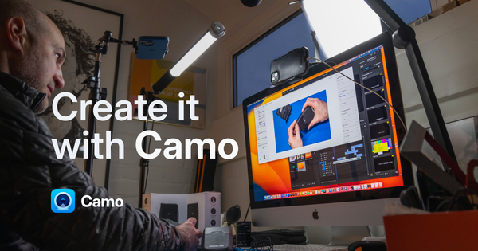

## Summary
Camo enables the camera you already own to produce incredible video, whether you’re meeting, streaming, or recording. Start creating great video today.

## Key Details
- **Source:** [reincubate.com](https://reincubate.com/camo/)
- **Title:** Camo Studio - Stand out video with any camera
- **Description:** Camo enables the camera you already own to produce incredible video, whether you’re meeting, streaming, or recording. Start creating great video today

## Visual Assets

