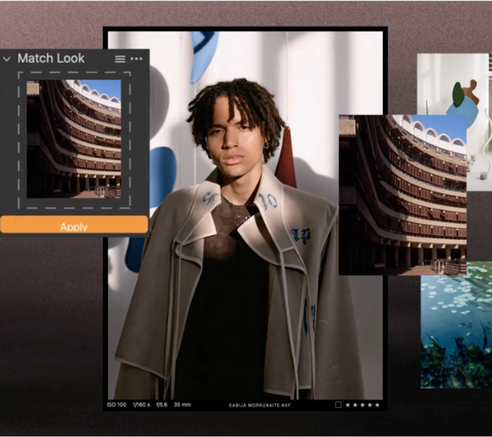

## Summary
The gold standard of photo editing. Trusted by pros. Render the highest-quality images and edit better photos with precision tools and smart shortcuts. Try it free.

## Key Details
- **Source:** [captureone.com](https://www.captureone.com/en)
- **Title:** Capture One Professional Photo Editing Software: Elevate Your Photography
- **Description:** The gold standard of photo editing. Trusted by pros. Render the highest-quality images and edit better photos with precision tools and smart shortcuts

## Visual Assets

