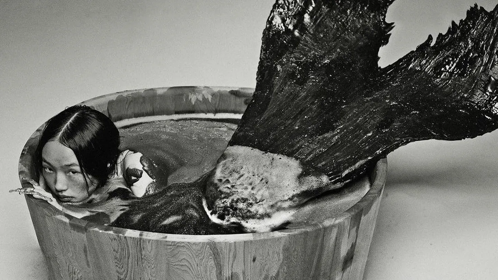

## Summary
Cathy Dolle is a designer and front-end developer who creates simple, thoughtful digital experiences with a minimalist, detail-driven approach. She enjoys shaping quiet, refined identities and occasio

## Key Details
- **Source:** [cathydolle.com](https://www.cathydolle.com/)
- **Title:** Cathy DOLLE - Interactive Designer
- **Description:** Cathy Dolle is a designer and front-end developer who creates simple, thoughtful digital experiences with a minimalist, detail-driven approach. She en

## Visual Assets

