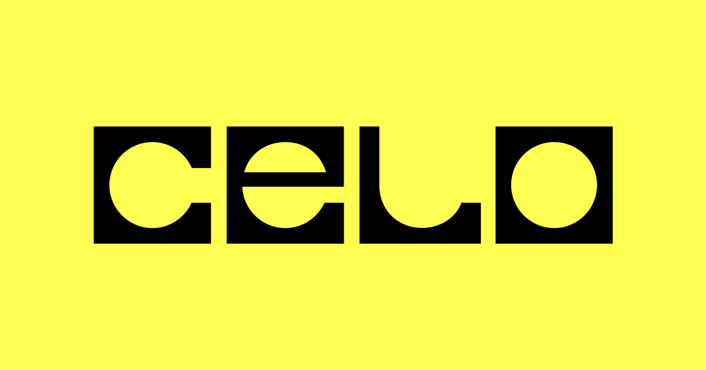

## Summary
Celo is an Ethereum L2 powering fast, low-cost payments, native stablecoins, and DeFi apps — driving real-world adoption and financial inclusion worldwide.

## Key Details
- **Source:** [celo.org](https://celo.org/)
- **Title:** Celo: Ethereum Layer 2 for Payments, Stablecoins & DeFi
- **Description:** Celo is an Ethereum L2 powering fast, low-cost payments, native stablecoins, and DeFi apps — driving real-world adoption and financial inclusion world

## Visual Assets

