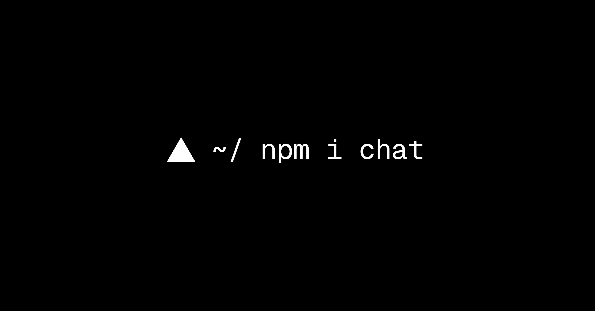

## Summary
A unified TypeScript SDK for building chat bots across Slack, Microsoft Teams, Google Chat, Discord, and more. Write your bot logic once, deploy everywhere.

## Key Details
- **Source:** [chat-sdk.dev](https://chat-sdk.dev/)
- **Title:** Chat SDK
- **Description:** A unified TypeScript SDK for building chat bots across Slack, Microsoft Teams, Google Chat, Discord, and more. Write your bot logic once, deploy every

## Visual Assets

