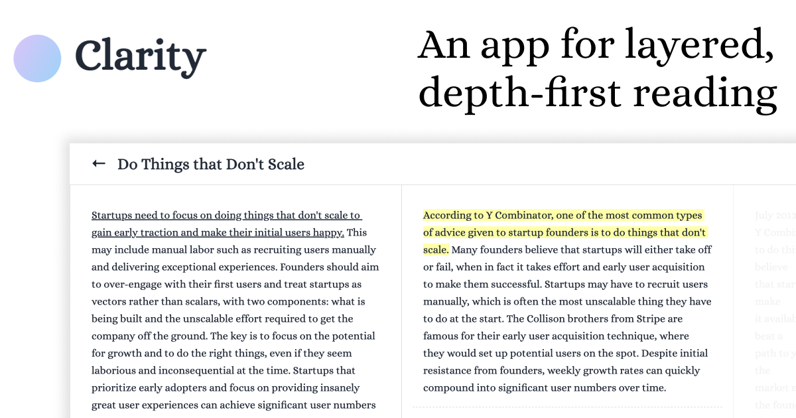

## Summary
An app for layered, depth-first reading — start with summaries, tap to
explore details, and gain clarity on complex topics.

## Key Details
- **Source:** [clarity.rahul.gs](https://clarity.rahul.gs/)
- **Title:** Clarity
- **Description:** An app for layered, depth-first reading — start with summaries, tap to
explore details, and gain clarity on complex topics.

## Visual Assets

