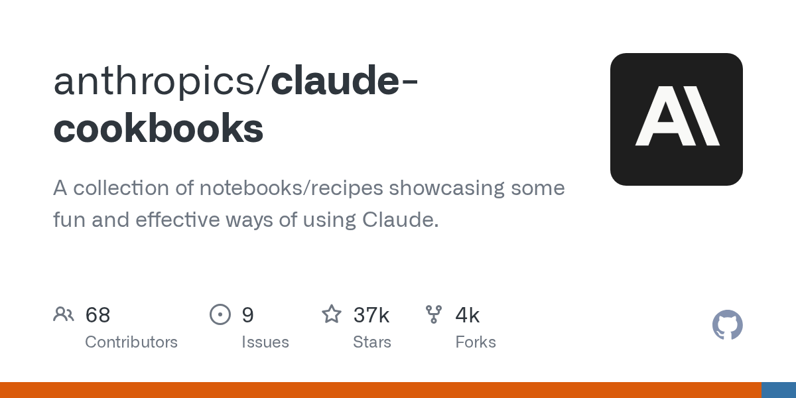

## Summary
A collection of notebooks/recipes showcasing some fun and effective ways of using Claude. - anthropics/claude-cookbooks

## Key Details
- **Source:** [github.com](https://github.com/anthropics/claude-cookbooks/tree/main/patterns/agents)
- **Title:** claude-cookbooks/patterns/agents at main · anthropics/claude-cookbooks
- **Description:** A collection of notebooks/recipes showcasing some fun and effective ways of using Claude. - anthropics/claude-cookbooks

## Visual Assets

