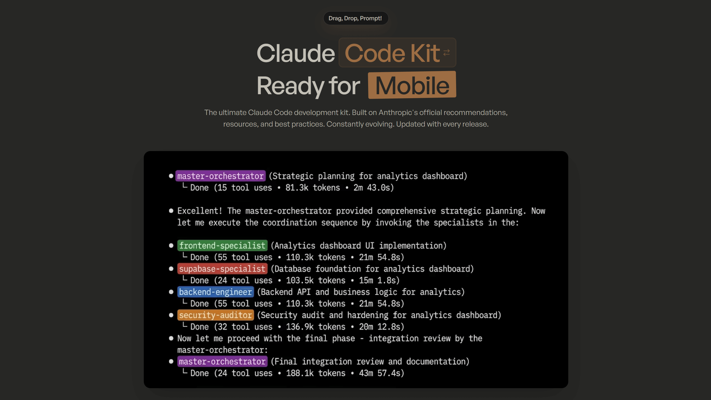

## Summary
Transform Claude into your dev & growth teams. 16 agents, 280 skill files, 90,000+ lines of workflows and frameworks. From first commit to first customer.

## Key Details
- **Source:** [claudefa.st](https://claudefa.st/)
- **Title:** Claude Fast: AI Led Development + Growth Marketing Kits
- **Description:** Transform Claude into your dev & growth teams. 16 agents, 280 skill files, 90,000+ lines of workflows and frameworks. From first commit to first custo

## Visual Assets

