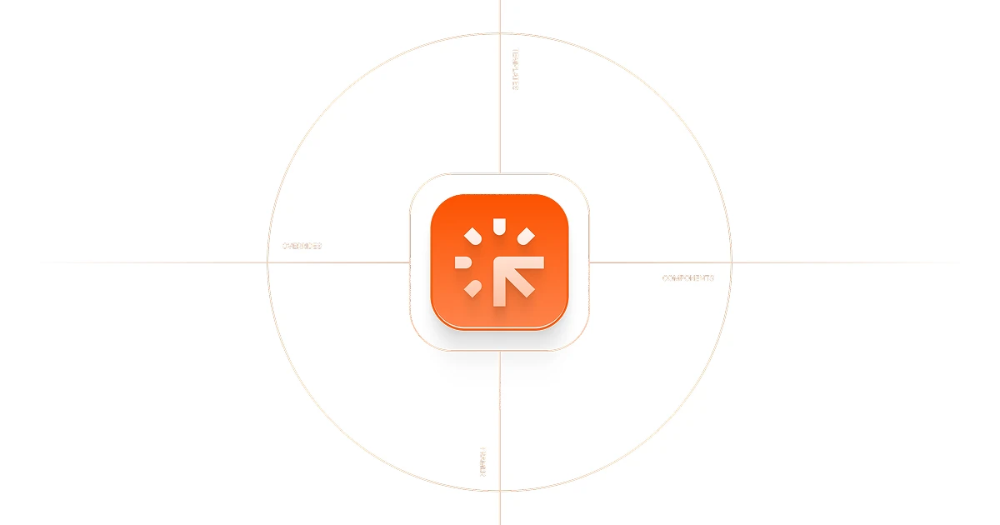

## Summary
clicks.supply is a collection of premium Framer templates, components, overrides, and tutorials. Most of them are entirely free, so feel free to take a look!

## Key Details
- **Source:** [clicks.supply](https://clicks.supply/)
- **Title:** clicks.supply · Framer templates, components, & tutorials
- **Description:** clicks.supply is a collection of premium Framer templates, components, overrides, and tutorials. Most of them are entirely free, so feel free to take 

## Visual Assets

