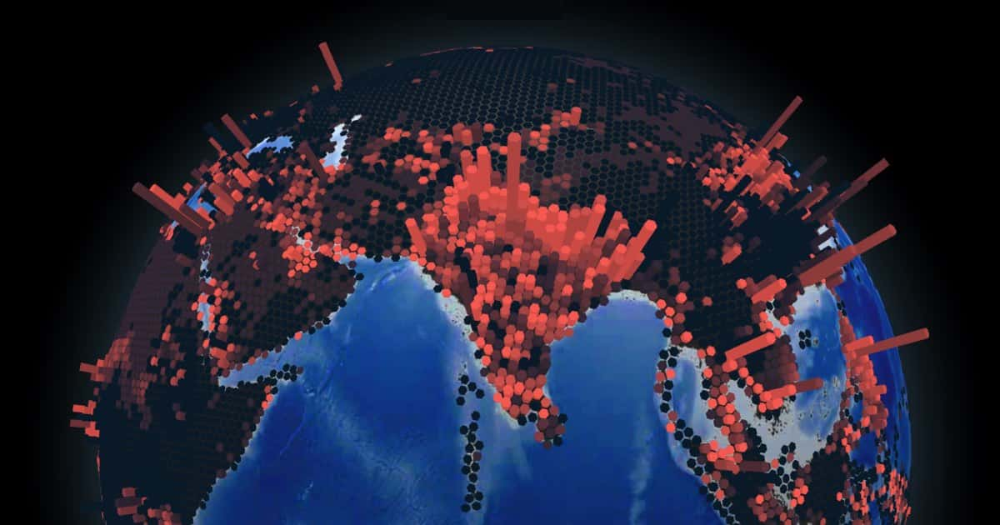

## Summary
Lethal heat, flooded coastlines, powerful tropical storms: Find out where populations are projected to be hit hardest with our interactive 3D visualisation.

## Key Details
- **Source:** [interaktiv.morgenpost.de](https://interaktiv.morgenpost.de/klimawandel-hitze-meeresspiegel-wassermangel-stuerme-unbewohnbar/en.html?utm_source=DenseDiscovery-254)
- **Title:** Climate change: Mapping in 3D where the earth will become uninhabitable
- **Description:** Lethal heat, flooded coastlines, powerful tropical storms: Find out where populations are projected to be hit hardest with our interactive 3D visualis

## Visual Assets

