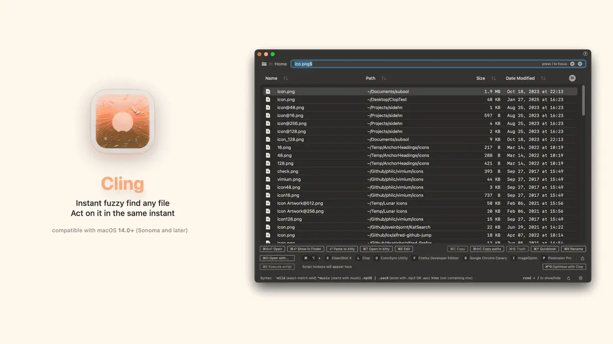

## Summary
Instant fuzzy find any file, act on it in the same instant

## Key Details
- **Source:** [lowtechguys.com](https://lowtechguys.com/cling/)
- **Title:** Cling - Instant fuzzy find any file, act on it in the same instant
- **Description:** Instant fuzzy find any file, act on it in the same instant

## Visual Assets

