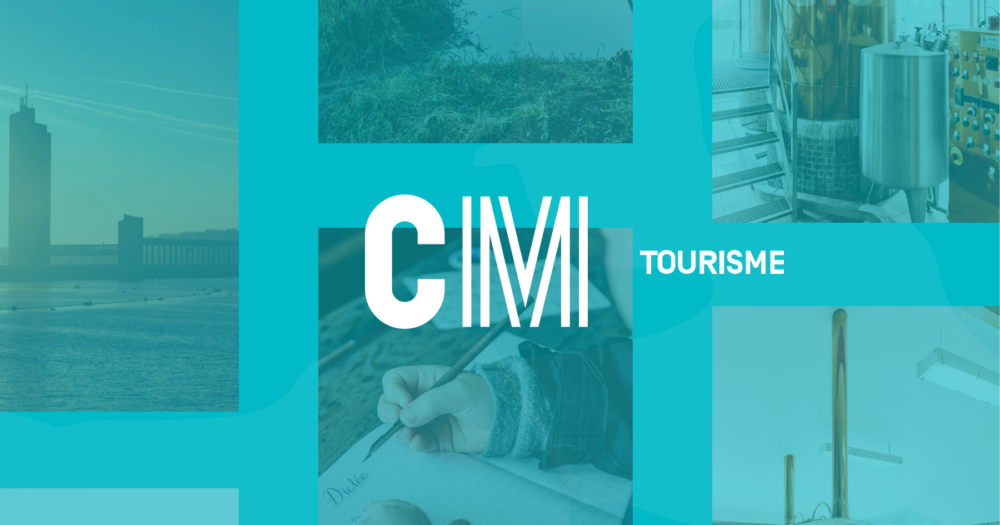

## Summary
Découvrez la plateforme qui regroupe les activités et les lieux touristiques des maisons du tourisme « Pays des Lacs » et « Pays de Charleroi ».

## Key Details
- **Source:** [cm-tourisme.be](https://www.cm-tourisme.be/)
- **Title:** CM-Tourisme, la plateforme de Charleroi Métropole dédiée au tourisme.
- **Description:** Découvrez la plateforme qui regroupe les activités et les lieux touristiques des maisons du tourisme « Pays des Lacs » et « Pays de Charleroi ».

## Visual Assets

