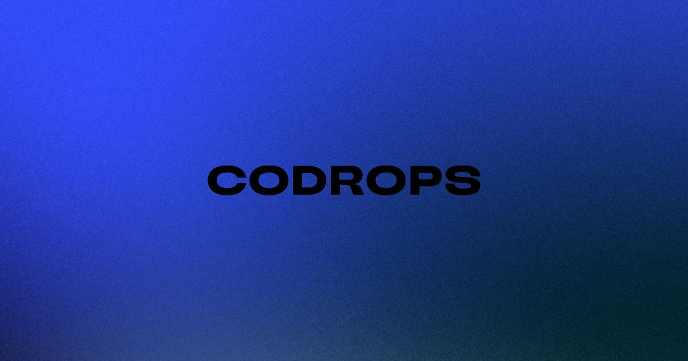

## Summary
Explore the latest web design and frontend development trends with tutorials, demos, and creative coding resources.

## Key Details
- **Source:** [tympanus.net](https://tympanus.net/codrops/)
- **Title:** Codrops | Fueling web creativity since 2009
- **Description:** Explore the latest web design and frontend development trends with tutorials, demos, and creative coding resources.

## Visual Assets

