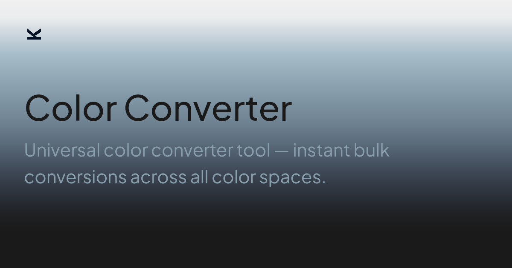

## Summary
Universal color converter tool — instant bulk conversions across all color spaces.

## Key Details
- **Source:** [lik.ai](https://lik.ai/tools/color-convertor/)
- **Title:** Color Converter
- **Description:** Universal color converter tool — instant bulk conversions across all color spaces.

## Visual Assets

