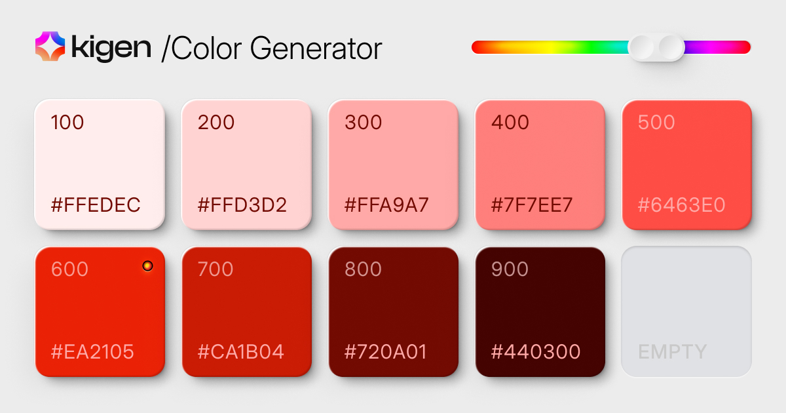

## Summary
Generate beautiful color palettes for your design system.

## Key Details
- **Source:** [kigen.design](https://kigen.design/color)
- **Title:** Color Generator – Kigen
- **Description:** Generate beautiful color palettes for your design system.

## Visual Assets

