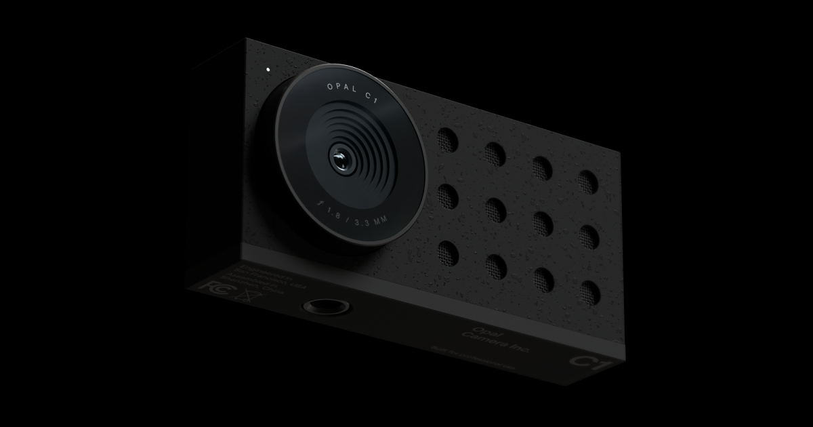

## Summary
Composer is Opal's video editing camera software. Composer powers up all the capabilities of your camera and help you create the perfect picture, save presets and become a better presenter.

## Key Details
- **Source:** [opalcamera.com](https://opalcamera.com/opal-composer)
- **Title:** Composer — The magic behind the camera
- **Description:** Composer is Opal's video editing camera software. Composer powers up all the capabilities of your camera and help you create the perfect picture, save

## Visual Assets

