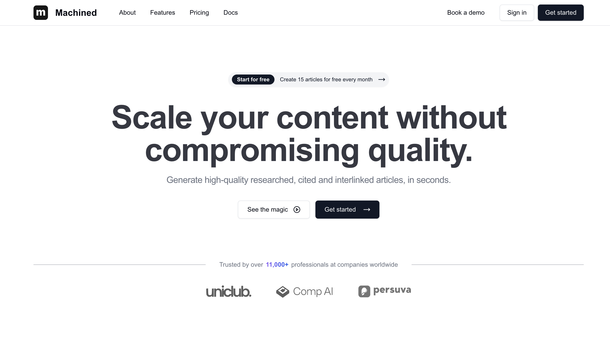

## Summary
Build topical authority at scale with AI-powered research, writing & interlinking. Automate keyword research, content generation, internal linking, and publishing.

## Key Details
- **Source:** [machined.ai](https://machined.ai/)
- **Title:** Content Cluster Automation Platform | Machined
- **Description:** Build topical authority at scale with AI-powered research, writing & interlinking. Automate keyword research, content generation, internal linking, an

## Visual Assets

