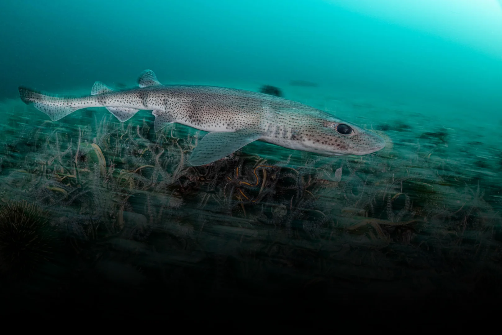

## Summary
Pioneering research quantifying ocean carbon storage in seabed sediments. Discover the science and collaborators working to combat climate change.

## Key Details
- **Source:** [convexseascapesurvey.com](https://convexseascapesurvey.com/)
- **Title:** Convex Seascape Survey | Ocean & Climate Research
- **Description:** Pioneering research quantifying ocean carbon storage in seabed sediments. Discover the science and collaborators working to combat climate change.

## Visual Assets

