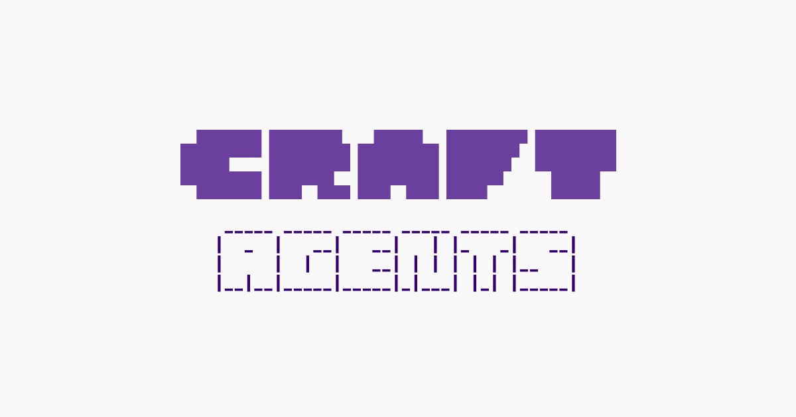

## Summary
An open source desktop app for working with AI agents. Connect any API or MCP server. Multitask naturally. Make it yours.

## Key Details
- **Source:** [agents.craft.do](https://agents.craft.do/)
- **Title:** Craft Agents - The Open Source Agent Interface
- **Description:** An open source desktop app for working with AI agents. Connect any API or MCP server. Multitask naturally. Make it yours.

## Visual Assets

