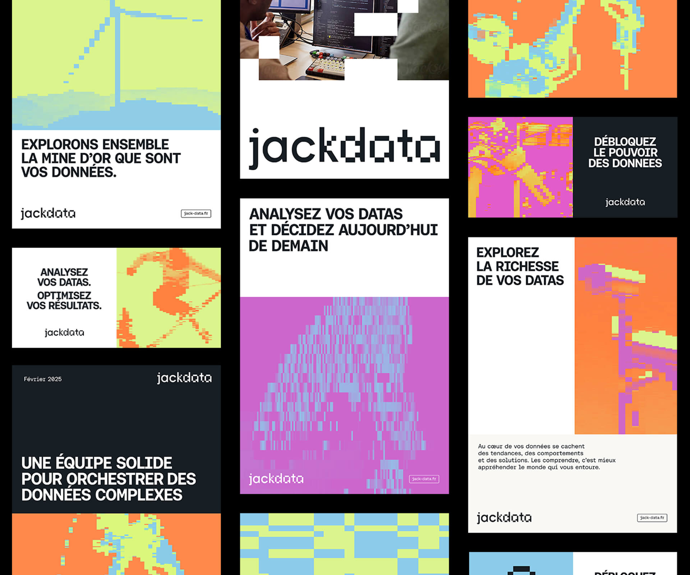

## Summary
Saved from antoinepeltier.com: Création de l’identité visuelle de Jackdata | Antoine Peltier

## Key Details
- **Source:** [antoinepeltier.com](https://antoinepeltier.com/projets/jackdata-analyse-donnees)
- **Title:** Création de l’identité visuelle de Jackdata | Antoine Peltier

## Visual Assets

