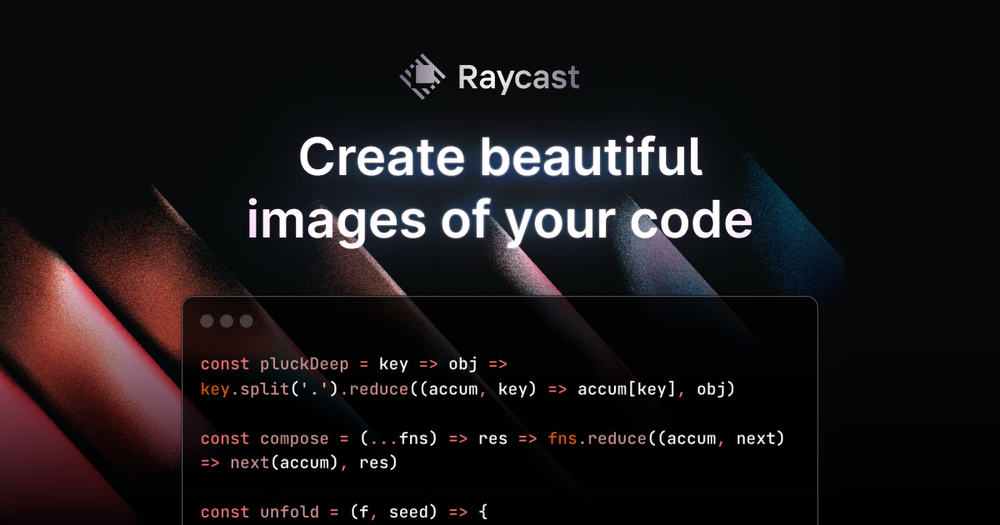

## Summary
Turn your code into beautiful images. Choose from a range of syntax colors, hide or show the background, and toggle between a dark and light window.

## Key Details
- **Source:** [ray.so](https://ray.so/)
- **Title:** Create beautiful images of your code
- **Description:** Turn your code into beautiful images. Choose from a range of syntax colors, hide or show the background, and toggle between a dark and light window.

## Visual Assets

