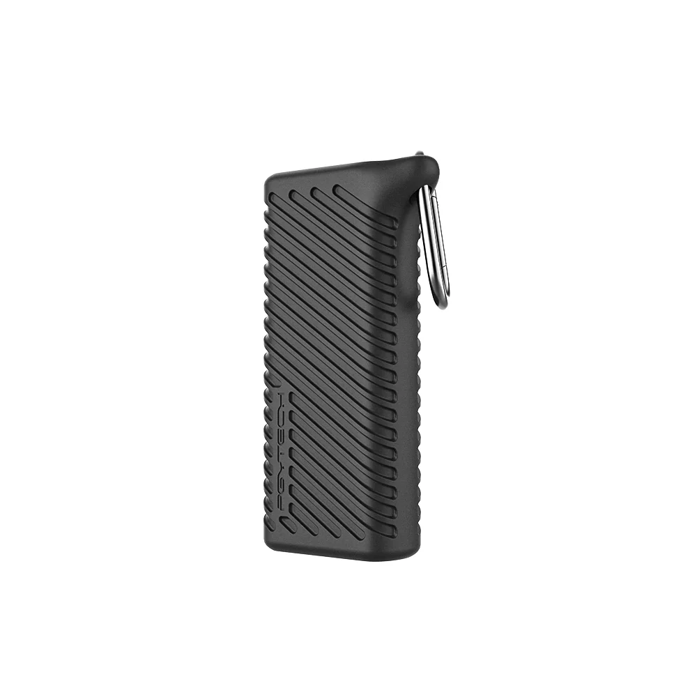

## Summary
2-in-1 Card Reader & Case: Perfect for photographers. Stores Nano SIMs, SD, and TF cards. USB 3.1, 312MB/s transfer speed, Type-C compatible, IP54 dust & water resistant.

## Key Details
- **Source:** [pgytech.com](https://www.pgytech.com/products/createmate-high-speed-card-reader-case)
- **Title:** CreateMate High-speed Card Reader Case
- **Description:** 2-in-1 Card Reader & Case: Perfect for photographers. Stores Nano SIMs, SD, and TF cards. USB 3.1, 312MB/s transfer speed, Type-C compatible, IP54 dus

## Visual Assets

