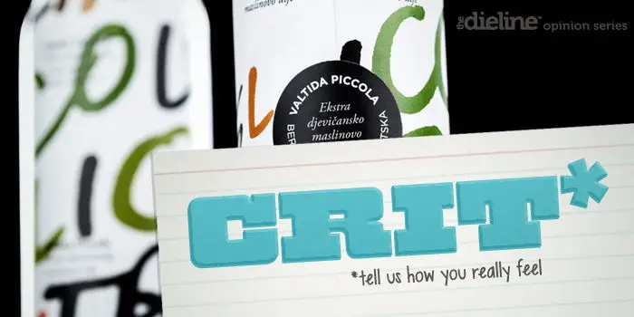

## Summary
Multidisciplinary design and advertising agency Bruketa&Žini?have recently completed the packaging for Valtida Piccola, a handmade olive oil produced in the Istria region of Croatia. Their design solu

## Key Details
- **Source:** [thedieline.com](http://www.thedieline.com/blog/2013/3/4/crit-valtida-piccola.html)
- **Title:** Crit* Valtida Piccola
- **Description:** Multidisciplinary design and advertising agency Bruketa&Žini?have recently completed the packaging for Valtida Piccola, a handmade olive oil produced 

## Visual Assets

