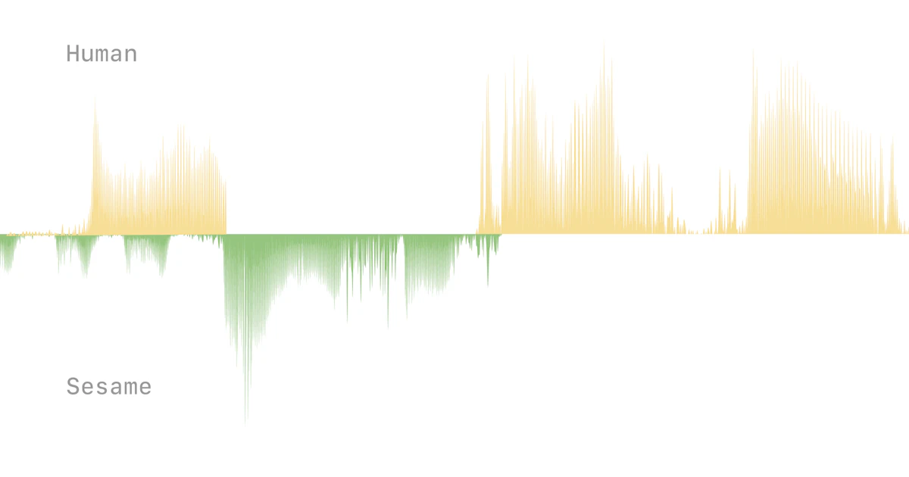

## Summary
At Sesame, our goal is to achieve “voice presence”—the magical quality that makes spoken interactions feel real, understood, and valued. 

## Key Details
- **Source:** [sesame.com](https://www.sesame.com/research/crossing_the_uncanny_valley_of_voice#demo)
- **Title:** Crossing the uncanny valley of conversational voice
- **Description:** At Sesame, our goal is to achieve “voice presence”—the magical quality that makes spoken interactions feel real, understood, and valued. 

## Visual Assets

