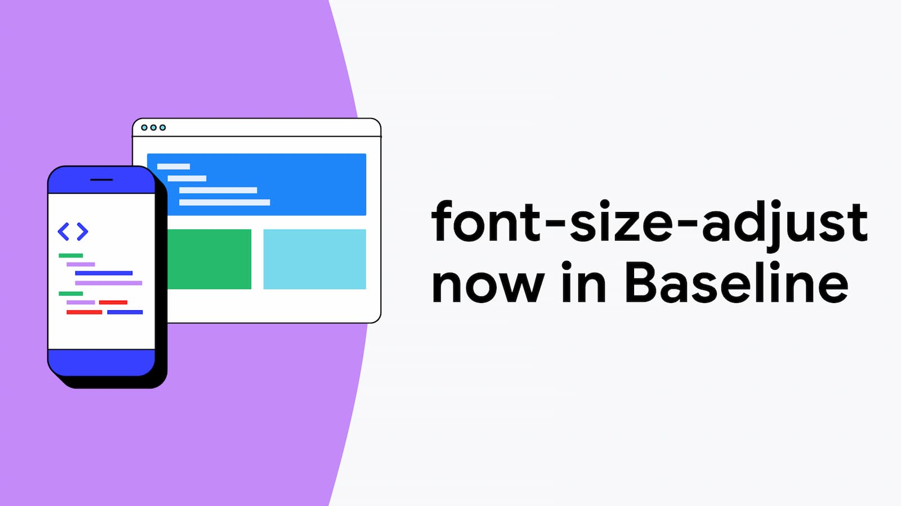

## Summary
Improve the legibility of text when using fallback fonts.

## Key Details
- **Source:** [web.dev](https://web.dev/blog/font-size-adjust)
- **Title:** CSS font-size-adjust is now in Baseline  |  Blog  |  web.dev
- **Description:** Improve the legibility of text when using fallback fonts.

## Visual Assets

