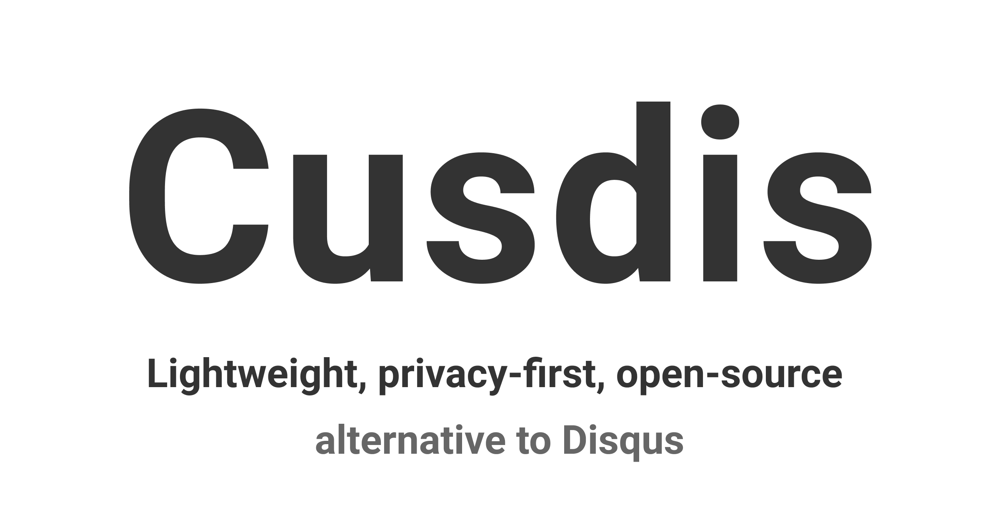

## Summary
Cusdis is an open-source, lightweight (~5kb gzipped), privacy-first alternative to Disqus. It's super easy to use and integrate with your existed website

## Key Details
- **Source:** [cusdis.com](https://cusdis.com/?ref=producthunt)
- **Title:** Cusdis - Lightweight, privacy-first, open-source comment system
- **Description:** Cusdis is an open-source, lightweight (~5kb gzipped), privacy-first alternative to Disqus. It's super easy to use and integrate with your existed webs

## Visual Assets

