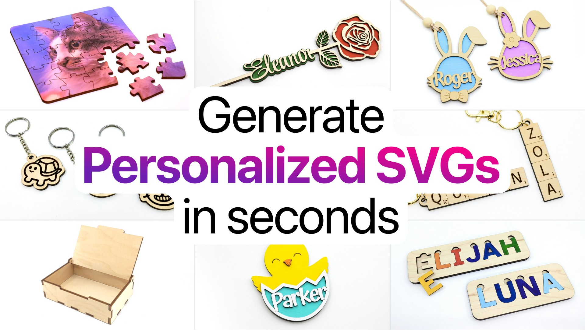

## Summary
Cuttle is a web-based design tool for laser cutting. Make personalized ornaments, cake toppers, keychains, boxes, jewelry, connected text, and more.

## Key Details
- **Source:** [cuttle.xyz](https://cuttle.xyz/)
- **Title:** Cuttle: Generate Personalized SVG Cut Files in seconds
- **Description:** Cuttle is a web-based design tool for laser cutting. Make personalized ornaments, cake toppers, keychains, boxes, jewelry, connected text, and more.

## Visual Assets

