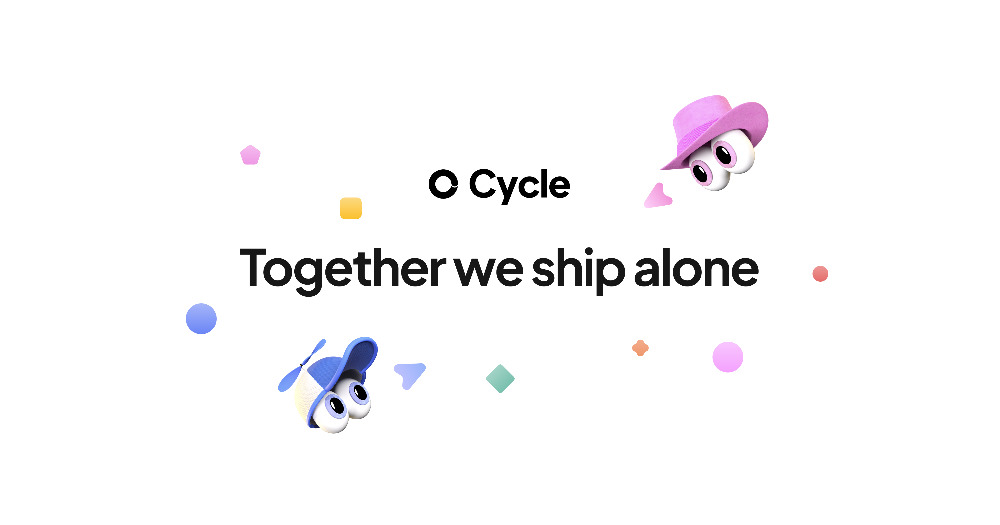

## Summary
Cycle is the fastest way for your team to capture product feedback and share customer insights – without the busywork.

## Key Details
- **Source:** [cycle.app](https://www.cycle.app/)
- **Title:** Cycle is the fastest way for your team to capture product feedback and share customer insights – without the busywork.
- **Description:** Cycle is the fastest way for your team to capture product feedback and share customer insights – without the busywork.

## Visual Assets

