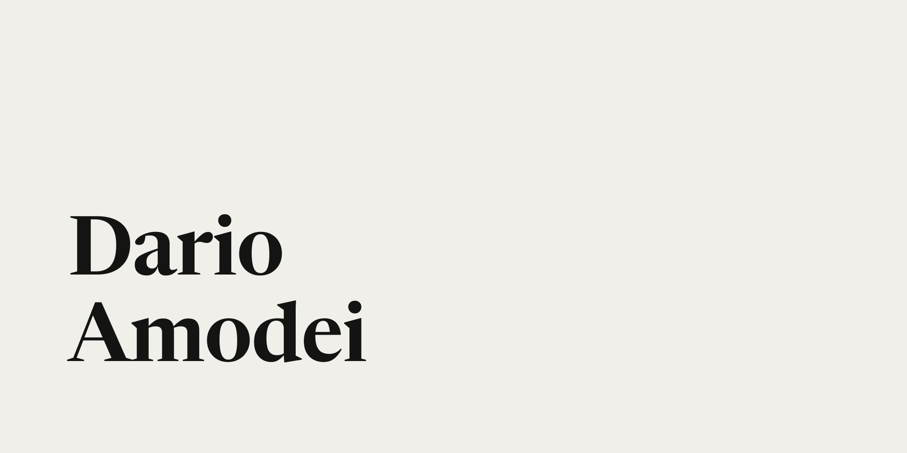

## Summary
Dario Amodei is the CEO of Anthropic, a public benefit corporation dedicated to building AI systems that are steerable, interpretable and safe.

## Key Details
- **Source:** [darioamodei.com](https://darioamodei.com/)
- **Title:** Dario Amodei is the CEO of Anthropic, a public benefit corporation dedicated to building AI systems that are steerable, interpretable and safe.
- **Description:** Dario Amodei is the CEO of Anthropic, a public benefit corporation dedicated to building AI systems that are steerable, interpretable and safe.

## Visual Assets

