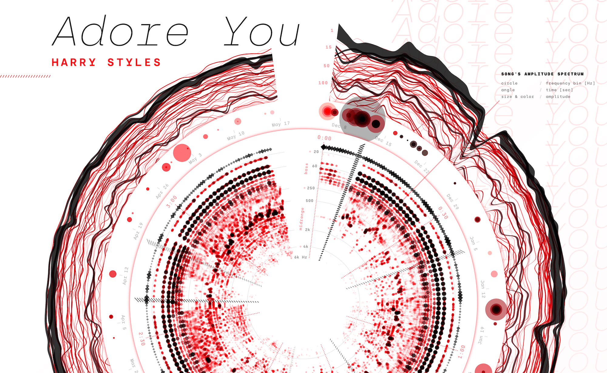

## Summary
Explaining the creation process of my Sony Music data art poster series

## Key Details
- **Source:** [visualcinnamon.com](https://www.visualcinnamon.com/2020/06/sony-music-data-art/#final-result-animated-poster)
- **Title:** Data art posters about music (streaming) data for Sony Music
- **Description:** Explaining the creation process of my Sony Music data art poster series

## Visual Assets

