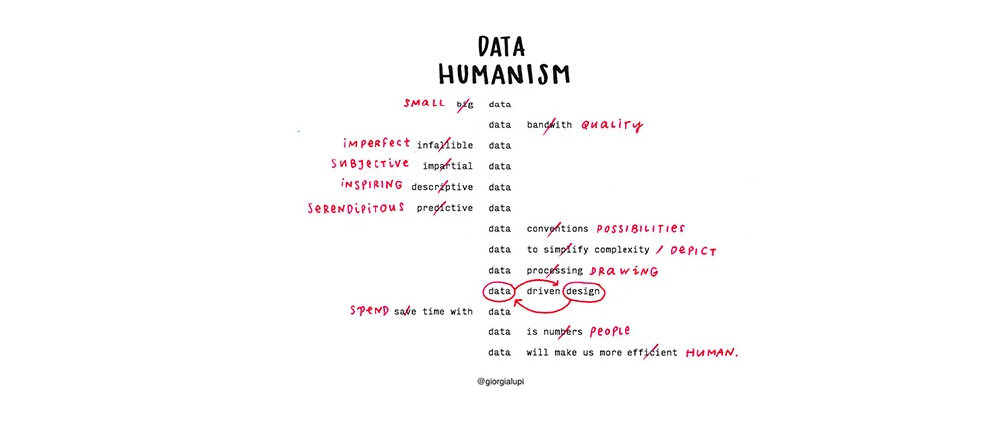

## Summary
Saved from giorgialupi.com: Data Humanism — giorgialupi

## Key Details
- **Source:** [giorgialupi.com](http://giorgialupi.com/data-humanism-my-manifesto-for-a-new-data-wold)
- **Title:** Data Humanism — giorgialupi

## Visual Assets

