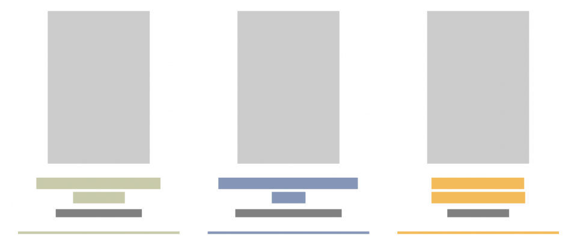

## Summary
Want something new for your bookshelf? Here's our library of dataviz books everyone should read.

## Key Details
- **Source:** [informationisbeautiful.net](https://informationisbeautiful.net/visualizations/dataviz-books/)
- **Title:** Data-Visualization Books Everyone Should Read — Information is Beautiful
- **Description:** Want something new for your bookshelf? Here's our library of dataviz books everyone should read.

## Visual Assets

