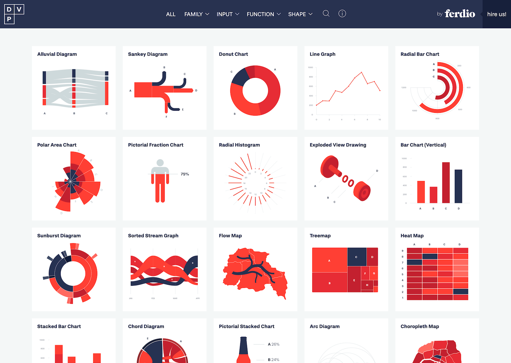

## Summary
Collection of data visualizations to get inspired and find the right type

## Key Details
- **Source:** [datavizproject.com](https://datavizproject.com/)
- **Title:** Data Viz Project
- **Description:** Collection of data visualizations to get inspired and find the right type

## Visual Assets

