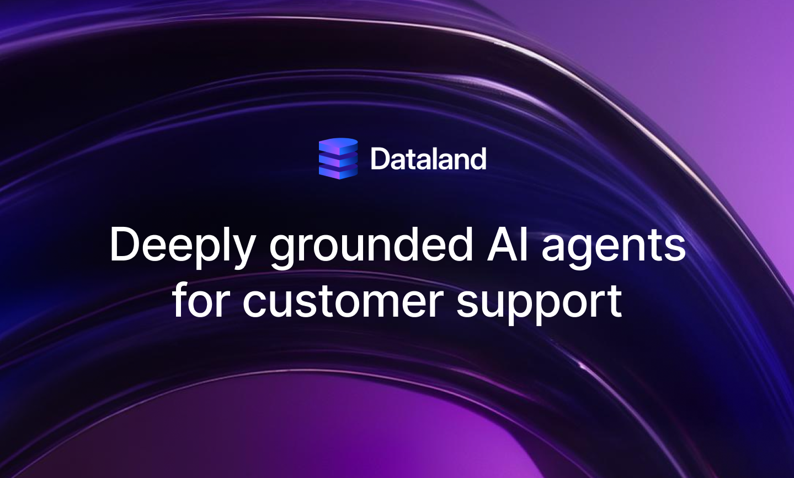

## Summary
Dataland builds deeply grounded AI agents for customer support. Our AI auto-resolves customer issues with deep accuracy, by plugging into your internal systems, knowledge base, and past ticket resolut

## Key Details
- **Source:** [dataland.io](https://dataland.io/)
- **Title:** Dataland | AI agents for customer support
- **Description:** Dataland builds deeply grounded AI agents for customer support. Our AI auto-resolves customer issues with deep accuracy, by plugging into your interna

## Visual Assets

