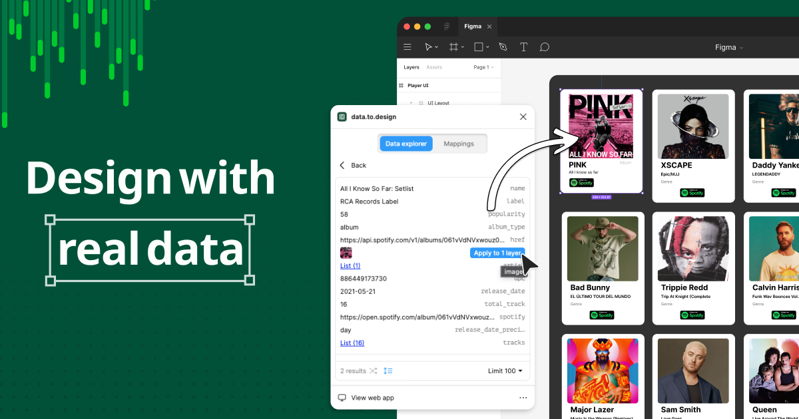

## Summary
data.to.design makes it easy to generate and access the content you need, so you can design faster than ever.

## Key Details
- **Source:** [data.to.design](https://data.to.design/)
- **Title:** data.to.design makes it easy to generate and access the content you need, so you can design faster than ever.
- **Description:** data.to.design makes it easy to generate and access the content you need, so you can design faster than ever.

## Visual Assets

